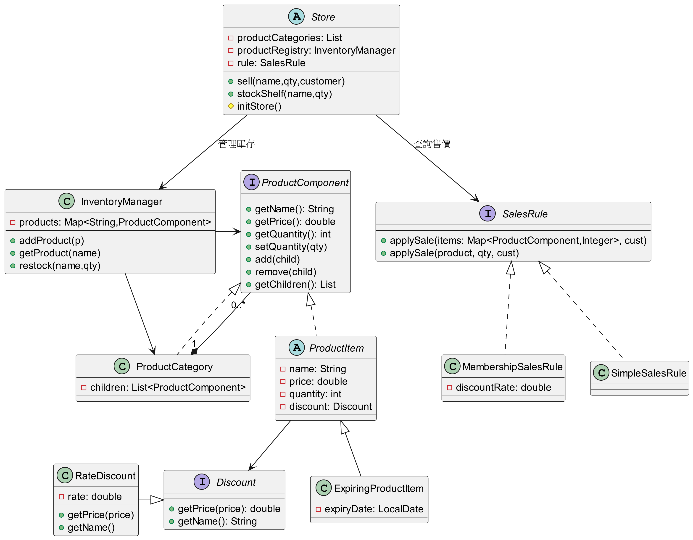
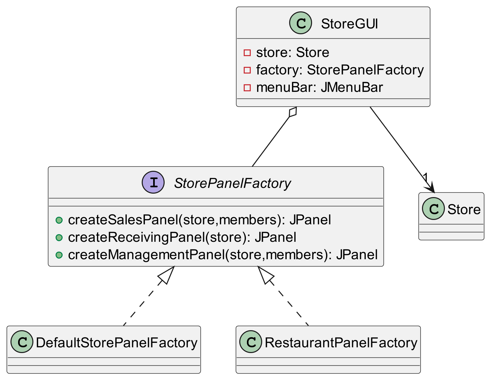
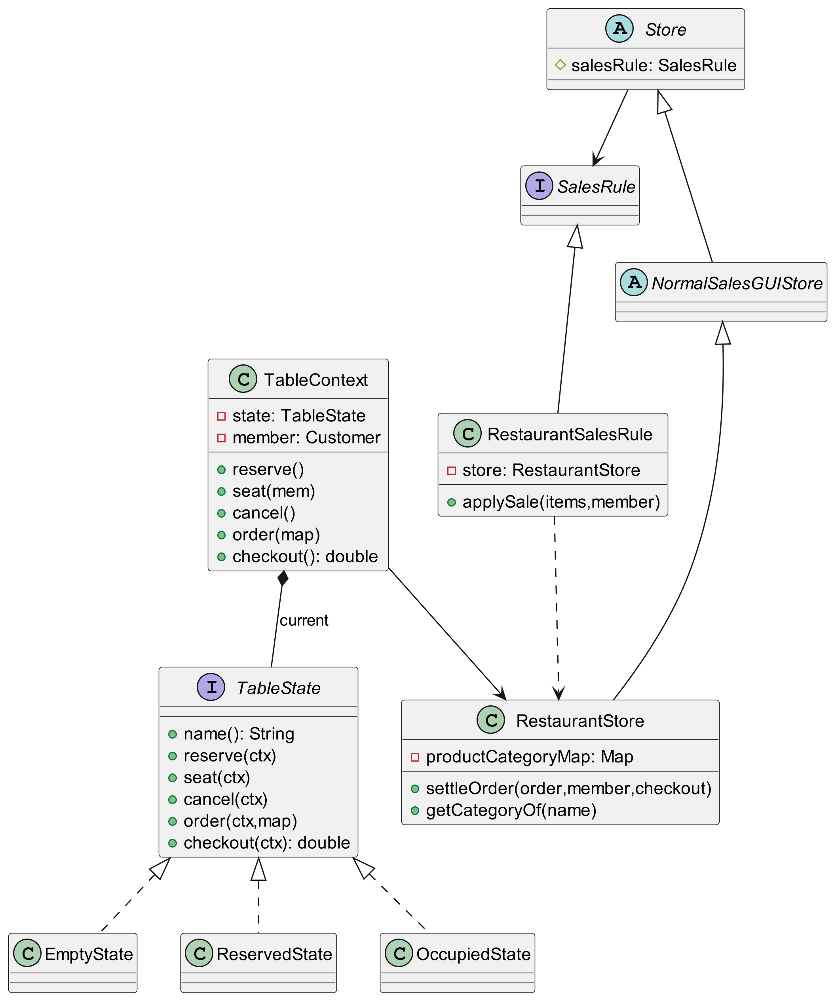
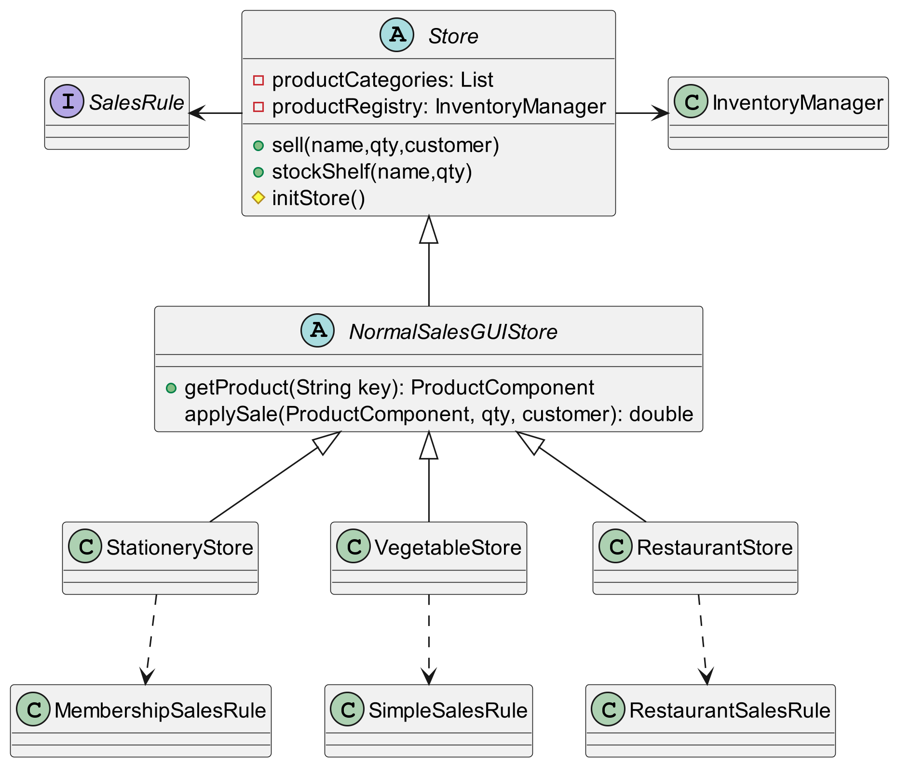

# 軟體框架設計期末報告

## 各種商店的銷售與庫存管理框架

### 第九組 組員

呂家耀 D1110737 

邱禾朋 D1149427 

林奕恩 D1149593 

林肯銳 D1149724

## 功能發想

各式販售商品的商店(如餐廳、超商、文具店等)會有一些類似的行為，例如販賣商品、進貨與管理商品等，我們可以把這些功能抽象出一個框架。各式商店可以按照他們銷售運營規則進行細部實作。

### 抽象框架

大多數店家主要有兩項任務：

- **銷售產品：** 店家會有不同的銷售策略，例如特定商品打折、套餐優惠、會員優惠等。

- **庫存管理：** 店家需要管理店家擁有的庫存，當銷售時會減少庫存，進貨時會加庫存。

我們不確定店家的銷售策略，在銷售產品的策略上，將計算價格等方式延遲到店家的實作上。而庫存主要有名稱、售價、數量等屬性，有進貨與售貨的操作，這些都是產品的普遍特性，可在框架進行實作與封裝。

### 具體店家

我們設想了三種店家，分別是文具店、蔬菜店與餐廳。

- **文具店：** 如果有會員，則商品打九折。

- **蔬菜店：** 與文具店相似，但商品有特別的限時優惠，以及即期商品，有保存期限，套用不同的折價優惠。

- **餐廳：** 餐廳銷售不像一般商店那麼簡單，其中需要座位管理、套餐優惠策略等。

## UML類別圖與設計概念

### 核心框架

- 使用Composite包裝商品，指它們可以分類管理，以及更清楚的GUI顯示

- 每個ProductItem會有一個使用Strategy的Discount，代表打折促銷活動
  

### GUI抽象工廠

- 因為每個店家有售貨、進貨與管理三個GUI畫面，使用Abstract Factory包裝GUI的生產
  

### 餐廳狀態實作

- 在餐廳內，餐桌有3個狀態，使用State pattern管理餐桌狀態
  

### 抽象店家、實際店家與GUI委託繼承樹

- 在抽象店家與實際店家之間，為了讓GUI可以透過店家取得庫存資訊，使用中間的抽象類別設計委託方法。
  

## 未來展望

1. 在文具店加上會員積點功能，結帳時會員可消耗點數獲取金額折抵

2. 在蔬菜店的菜品期限加上實際用途，比對設定的今日日期，將過期商品自動下架，即期商品打折扣

3. 在結帳時支援不同付費系統，如現金、信用卡刷卡、電子支付等

## 統計資料與分工

本專案共2176行程式碼，所有組員皆有參與程式碼撰寫與簡報製作。

[專案Github](https://github.com/Tempest0220/Store-Master)
